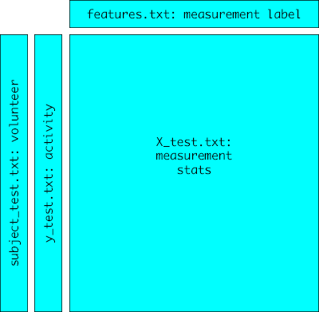
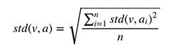

# `get_clean_data` Project

This is the end-of-course project for the JHU course on [Getting and Cleaning Data](https://www.coursera.org/learn/data-cleaning/) which is hosted on Coursera.

## Getting Started

### Background on Big Data in Sports Metrics

One of the most exciting areas in all of data science right now is wearable computing. Companies like Fitbit, Nike, and Jawbone Up are racing to develop the most advanced algorithms to attract new users. For more information, see the artcile [Big Data, Activity Tracking, And The Battle For The
world's Top Sports Brand](big_data_sports_article.pdf) written by David Stern.

### Prerequisites

This project uses the R programming language, and RStudio which is the defacto tool for working with R. This project repository is on GitHub. The specific versions used in developing this project were ...

* [R ver. 3.6.3](https://cran.r-project.org/)
* [RStudio ver. 1.2.5003](https://rstudio.com/products/rstudio/download/)
* [Project repository on GitHub](https://www.github.com/dador92/get_clean_data/)

While earlier versions of these technologies may work, the latest versions are recommended.

### Getting a Copy of the Project to Work With

Please clone the project into your own GitHub account and then access from that clone in your GitHub account via RStudio using the `File > New Project... > Version Control > Git` command.


## Running the Project

### Master Script

The project can be run using the [`run_analysis.R`](./run_analysis.R) script in the RStudio console as follows:
```
> source("run_analysis.R")
```

Utility functions are provided in the script file [`misc_functions.R`](./misc_functions.R) which are referenced as needed from the `run_analysis.R` script.

Realistically someone wanting to study the process will run a few line of the script at a time in RStudio. But remember that the script is sequential and each line of execution must be run in order.

### Raw Data Set

The required raw data set represents data collected from the accelerometers from  Samsung Galaxy S smartphones. The original data was obtained from the UCI Machine Learning Repository and contains a great discussion on [Human Activity Recognition Using Smartphones Data Set](http://archive.ics.uci.edu/ml/datasets/Human+Activity+Recognition+Using+Smartphones) if you're interested in the subject.

The project uses an extracted version of this data set which is downloaded by the `run_analysis.R` script directly from the JHU online repository. Due to its size (62.6 MB), the data set is *not* included in the GitHub repository.

#### Content

The raw data set consists of many files located in a nested directory structure. A description of the data contained therein is as follows:

* Thirty (30) Vounteers were split into two study groups titled "test" and "train". The division is as follows:
  + 9 volunteers in the test study group `{ 2, 4, 9, 10, 12, 13, 18, 20, 24 }`
  + 21 volunteers in the train study group `{ 1, 3, 5, 6, 7, 8, 11, 14, 15, 16, 17, 19, 21, 22, 23, 25, 26, 27, 28, 29, 30 }`
 * Using an accelerometer and gyroscope attached to each subject, the researchers took measurements from these devices while the volunteers engaged in 6 different activities, namely ...
   1. Walking (presumably horizontally)
   2. Walking Upstairs
   3. Walking Downstairs
   4. Sitting
   5. Standing
   6. Laying
* The measurements can be split between time measurements (some of which were taken in 3D) and those involving a Fast Fourier Transform (also some in 3D). Combined, they make up 33 different measurements, 8 of them with an X, Y, and Z component (i.e., 3D).
* After recording all the observations of the volunteers engaged in the 6 different activities across 33 measurements, the reasearchers statistically summarized each measurement 17 ways, including mean and standard deviation (which is the focus of the tidy data set). But that means that even the statistically summarized data contains `33 measurements x 17 statistics = 561 variables` which the researchers call "features".

#### Files of Interest

As a general observation, the data files in the raw data set are all fixed width text files. Not all the files will be used, which will be explained later. Here is a hierarchical listing of the files of interest and what they contain ...

* `HCI HAR Dataset` directory: root directory for the dataset
   + **`activity_labels.txt`** file: contains a mapping of the 6 different activities from the integer value used in the raw data set and the activities' textual descriptions
   + **`features.txt`** file: all 561 of the variable labels for the 17 statistics calculated on the 33 different measurements; in the raw data set a variable is called a "feature"
   + `test` subdirectory: where the data from the **test study group** resides
      - **`subject_test.txt`** file: a vector of the volunteer for each observation in the test main data set (which is `X_test.txt`)
      - **`y_test.txt`** file : a vector of the activity code (an integer) for each observation in the test main data set (which is `X_test.txt`); the textual description of each code is provided in the `activity_labels.txt` file located in the parent directory
      - **`X_test.txt`** file: the file for the test study group containing the 561 statistical values which breaks down into 17 statistical values for 33 measurements recorded by the accelerometer and gyroscope attached to each volunteer (2,947 rows of observations across 561 features/variables at 26.5 MB)
      - `Inertial Signals` subdirectory: ignored; more explanation later, but essentially the statistics needed for the tidy data set solution (mean and standard deviation) are already in the `X_test.txt` file in this subdrectory)

   + `train` subdirectory: where the data from the **train study group** resides
      - **`subject_train.txt`** file: a vector of the volunteer for each observation in the train main data set (which is `X_train.txt`)
      - **`y_train.txt`** file : a vector of the activity code (an integer) for each observation in the train main data set (which is `X_train.txt`); the textual description of each code is provided in the `activity_labels.txt` file located in the parent directory
      - **`X_train.txt`** file: the file for the train study group containing the 561 statistical values which breaks down into 17 statistical values for 33 measurements recorded by the accelerometer and gyroscope attached to each volunteer (7,352 rows of observations across 561 features/variables at 66 MB)
      - `Inertial Signals` subdirectory: ignored; more explanation later, but essentially the statistics needed for the tidy data set solution (mean and standard deviation) are already in the `X_train.txt` file in this subdrectory)

#### Initial Assembly of Raw Data

The initial assembly of the raw data in each study group from 4 separate files is done first to get a cohesive data set. This assembly is done for both the test study group as well as the train study group. Below is a graphic of the initial assembly of the raw data files for the test study group in order to get its initial cohesive data set.

<div align="center">
  </img>
</div>

Once both study groups have been loaded and assembled, they are combined into a single data table for tidying (titled `data.raw.all` in the script). This data table contains 564 columns and 10,299 rows and consumes 44.3 MB of memory.

## Making the Data Tidy

This section explains the fundamental steps taken by the `run_analysis.R` script to tidy up the raw data set and create data that is ready for analysis (pursuant to the requirements of the project rubric).

### Tidy Data Set Defined

The tidy data set for this project is defined in the [**Code Book**](./code_book.md). The operations performed on the raw data set (as described below) will transform it into the tidy data set that the Code Book describes. The explanation or motivation for each step in the transformation is explained with that transformation's description.

Canonically speaking, a tidy data set has the following attributes:

1. Each measured variable has its own column
2. Each unique observation has its own row
3. Each "kind" of variable has its own table (typically represented in R as a `data.table` structure)
4. If a tidy data set spans multiple tables, then each table should have at least one column (typically an ID of some sort) that links it into one or more other tables to facilitate integration of the data into a cohesive whole

A tidy data set has a few other *important* features:

* The top row of the data.table contains variable names
* The variable names can be read and understood


### General Explanation of the Tidying Steps

#### Step 1. Drop Unwanted Columns/Variables

**Motivation**: slim out a large data set before more expensive transformational functions are applied.

(Note: The dicussion forum for the course contains many comments about whether an early/initial narrowing of the data set is advisable. Most opted for the narrowing.)

Most of the columns can be deleted because (according to the rubric) only mean and standard deviation values are of interest. In particular, columns containing the following are kept:

* `study`: descriptive identifier
* `vols`: descriptive identifier
* `acts`: descriptive identifier
* `{measurement}-mean()`: desired measurement
* `{measurement}-std()`: desired measurement

In most cases it was easy to determine which variables/features to keep, but 13 contained the suffix `meanFreq()` and thus warranted additional consideration. The description of these "features" in the `features_info.txt` file is as follows:

> meanFreq(): Weighted average of the frequency components to obtain a mean frequency

Based on this description, I am excluding these variables/features, which leaves a total of 3 descriptive variables and 66 measurement variables prior to the next step in the tidying process.

The effect of these deletions is to reduce the size of the data set from 44.3 MB down to 5.3 MB. The reduced data set is stored in `data.s1` and has 69 columns and 10,299 rows.

#### Step 2. Average the Measurements for the Observations

**Motivation**: compress the observations/experiments down to a single set of values for each combination of study, volunteer and activity.

The raw data set contains approximately 50 observations/experiments for each combination of study, volunteer and the activities 2 through 6 (Walking Upstairs, Walking Downstairs, Sitting, Standing, Laying), while there are approximately 100 observations/experiments for activity 1 (Walking). Averaging the means and standard deviations yields a cleaner look at the data.

Theoretically, the same volunteer from a single study engaging in the same activity should not produce appreciable different results barring extenuating circumstances. Since the data set does not provide any information on extenuating circumstances to facilitate such an analysis, averaging the means and standard deviations by study, volunteer and activity seems useful and practical.

The average of the means is a simple average calculation. But averaging the standard deviations requires a more extensive calculation. First, you must square all of the standard deviations in order to convert them back to variances. Second, calculate a simple average of the variances. Third and finally, take the square root of the average variance.
<!--
\begin{equation}std(s,v,a) = \sqrt{\frac{\sum_{i=1}^{n} {std(s,v,a)}_i^2}{n}} \end{equation}

# sadly the above equation needs to be inserted as a graphic because GitHub won't process the formula
-->
<div align="center">
  </img>
</div>


... where *std(s,v,a)* is the average of the set of all standard deviations *std(s,v,a)<sub>i</sub>* from observations of a particular measure for an identifying combination of a study, volunteer, and activity.

In the R code, this is implemented in a funtion titled `averageOfStd()` which is defined in the `misc_functions.R` script file.

This coincidentally fixes the problem in the raw data where the standard deviation is frequently recorded as a negative number. In the tidy data, all of the standard deviations are now positive. With a standard deviation, the amount of the deviation is significant; whether you're considering the variance on the positive or negative side of the mean is not significant. (Note: see page 2 of [MIT lecture notes on Variance of Discrete Random Variables](https://ocw.mit.edu/courses/mathematics/18-05-introduction-to-probability-and-statistics-spring-2014/readings/MIT18_05S14_Reading5a.pdf) for an explaination of why positive values are used for standard deviations.)

The effect of these summaries is to reduce the size of the data set from 5.3 MB down to 105.6 *KB*. The reduced data set is stored in `data.s2` which has the same 69 columns but now only 180 rows.

Note: During this step the summarization split the data set between mean() measures and std() measures. These two subsets of the have been merged at the end of this step so that metrics can be taken. But for the next step, the separated subsets of data are needed.


#### Step 3. Reshaping by Converting Variables to Observations

**Motivation**: convert mis-categorized variables/features into observations.

The studies (test and train) only contain two true quantifiable variables of interest (as defined by the project rubric): `mean()` and `std()`. Most of the items listed as variables/features should actually be part of the observation identification set which should be made up of the following four identifiers:

1. study
2. volunteer (a non-descript integer value)
3. activity
4. measurement

This step implements that conversion using R's `melt()` functionality. Carrying forward the separated subsets of data from the previous step, it's straightforward to melt them separately and then merge them in preparation for the final step (discussed in the next section).

As part of the conversion, the names of the measures are truncated to eliminate `-mean()` and `-std()` since those are converted to column labels for the two remaining quantifiable variables. So the measurment labels in both subsets of data are now identical and can be included in the list of merge identifiers.

What remains is a merged data set with the following 6 column labels:

* `study`
* `vols`
* `acts`
* `measure`
* `mean`
* `std`

The melting actually increases the size of the data set (`data.s3`) up to 188.4 KB. In terms of dimensions, the columns shrink down to the 6 enumerated in the list above, while the rows/observations increase to 5,940 (= 30 volunteers * 6 activities * 33 measures).


#### Step 4. Clean Up Labels, Sort, Save

**Motivation**: make the data set more presentable to the user and store the work for later retrieval

As a final step in the tidying process, the following cosmetic changes were made to the data.

a. The integer code for the activities is swapped out for the actual activity name
b. The working titles for the columns are replaced by more readable labels, specifically ...
   - `volunteer`
   - `study`
   - `activity`
   - `measure`
   - `mean`
   - `std.dev`
c. The data table is sorted (arranged) using `volunteer`, `study`, `activity`, and `measure` in that order.

The tidy data set (`data.s4`) takes up 213.8 KB of memory. The dimensions haven't changed from the previous step.

Finally the data table is saved to a CSV file named `dataTidy.csv`. Note that if this file already exists, it gets overwritten. The file takes up 431 KB on disk.


#### Possible Tidying Steps Not Taken

First, the variable/feature names for the measurements were not cleaned up. Lacking any expertise in the subject matter, I did not feel comfortable converting any of these technical labels without the running the risk degrading their meaning. During Step 3, the qualifiers `mean()` and `std()` were dropped since these reamined as the column/variable/features labels of the measurement data.

The names of the decriptive variables were updated from their working titles.

Second, while the tidy data set is rather small, it may be helpful to add keys or indexes. Without knowing how the data set will be used, I cannot determine what keys/indexes to add.
